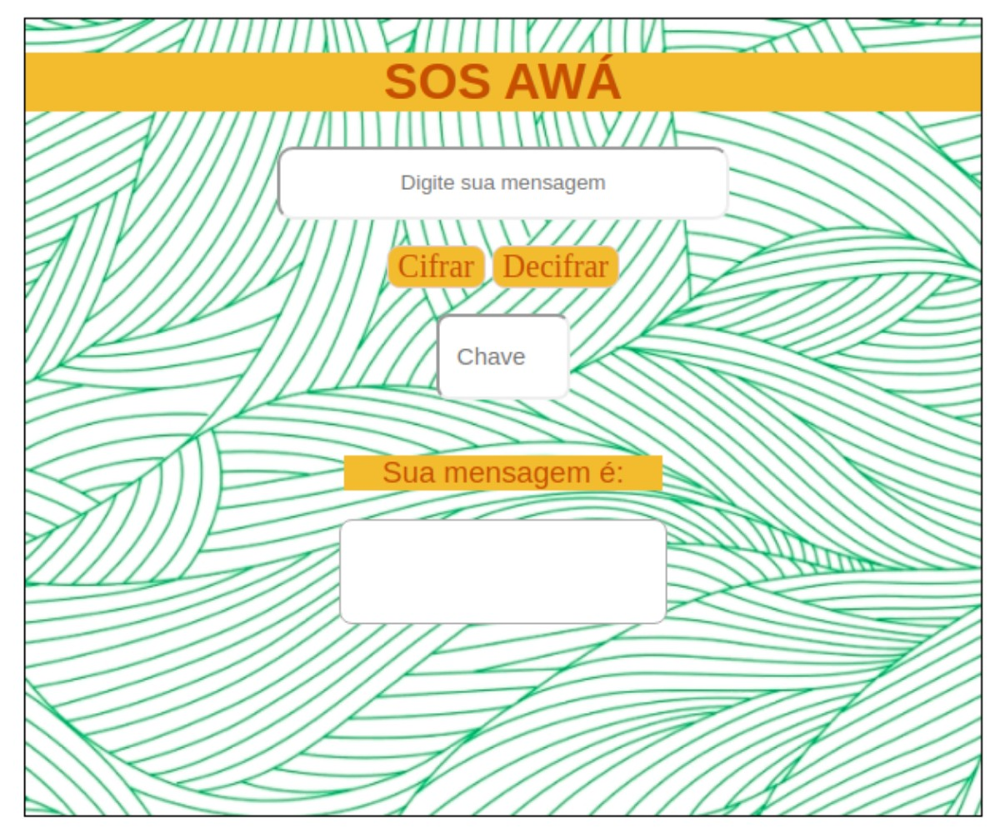
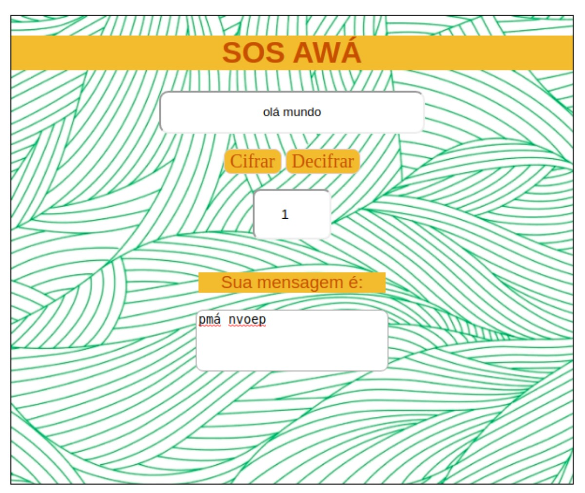
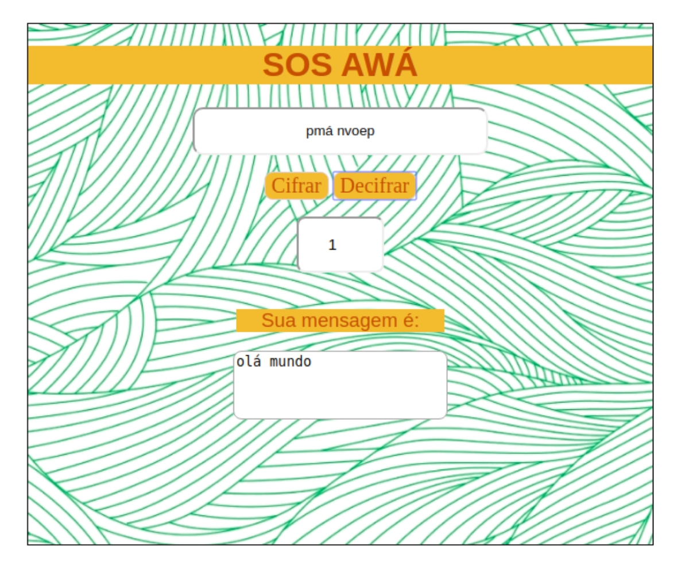

# Cifra de César

## Índice

* [1. Prefácio](#1-prefácio)
* [2. Resumo do projeto](#2-resumo-do-projeto)
* [3. Considerações Gerais](#3-Considerações-gerais)
* [4. Considerações gerais](#4-considerações-gerais)

***

## 1. Prefácio

Cifrar significa codificar. A [cifra de
César](https://pt.wikipedia.org/wiki/Cifra_de_C%C3%A9sar) é um dos primeiros
tipos de criptografias conhecidas na história. O imperador romano Júlio César
utilizava essa cifra para enviar ordens secretas aos seus generais no campo de
batalha.

## 2. Resumo do projeto

O projeto foi executado com a finalidade de cifrar e decifrar uma mensagem, através de uma chave de deslocamento. Projetado para atender ONGs de proteção da região amazônica brasileira, denunciando queimadas e outras ações ilegais, através de mensagens criptografadas.

## Utilização:

O app será a interface entre ONGs e populações da floresta que atuam como guardiões do terrirório amazônico, uma vez que, essas são as populações mais afetadas pela ausência do poder público na região. As mensagens criptografadas garantem menor risco a segurança do usuário. 

## Motivação:

Pensado a partir da repercursão mundial do dia do fogo (resultado de sucessivas queimadas no território amazônico em 2019,a maior nos últimos 9 anos) e o desmonte das políticas públicas do governo brasileiro para preservação ambiental, desta forma o app permite ao usuário denunciar a organizações parceiras(Ongs) novas queimadas.

## Cores:

As cores escolhidas foram constrastantes entre verde e alaranjado;

## Nome da aplicação:

 O nome escolhido foi SOS Awá, segundo a organização Survival, é o povo indigena mais ameaçado de extinção no Brasil. 

## 3. Condições Gerais

Html: Construido a partir tags semânticas para deixar a solução acessível.
JavaScript: O arquivo cipher.js contêm formúlas para cifrar e decifrar mensagem e condicionais para receber o alfabeto maiúsculo e minúsculo. O Arquivo Index.js tem os eventos DOM da aplicação;
CSS: No CSS, foi utilizado classes para atribuir estilo,este que por sua vez, foi pensado para conferir a melhor experiência ao usuário.

Tela inicial:

O mecanismo de cifrar funciona ao digitar uma mensagem e escolher um número que será o deslocamento das letras e clique no botão Cifra e conferir sua mensagem:

Para decifar selecione a resposta da mensagem cifrada e clique no botão decifra como ilustra o exemplo abaixo:

